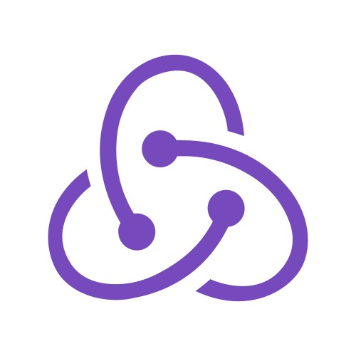

## Hello! 🏎

I am a 19-year-old responsible, reliable and willing to learn Computer Science 💻 student looking for a summer internship in the field of Software Engineering. I have spent the last year working on a ***TypeScript - React.js*** application to wirelessly show and graph real-time telemetry sensor data from a race car used during Formula Student competitions. During the previous years, I self-taught ***iOS development*** whilst pursuing High School and University level studies. I am always willing to learn and keen to be able to help a team achieve its goals and ambitions 🙂. 

#### Currently: 
* Head of Software Systems [@sufst](https://github.com/sufst)
* 2nd Year CS Student @ University of Southampton

#### Skills:

 
  
  
  
  
  
  
  

#### Personal Projects: 
1. **[HotelMovie](https://github.com/AndreasDemenagas/HotelMovieApp)** - iOS app for searching, viewing and saving movies. 
2. **[CourseBuddy](https://github.com/AndreasDemenagas/CourseBuddy)** - iOS app that lets you save and manage your IBDP courses smartly. 
3. **[Foodlink](https://github.com/AndreasDemenagas/Foodlink)** - iOS application for searching, looking and saving recipes. 
4. **TodoMaster** - Simple todo list application for iOS devices. Built with UIKit and CoreData. 
5. **Netflix Compositional** - Clone of the Netflix application using iOS' Compositional Layout APIs.

 

&nbsp;&nbsp;
